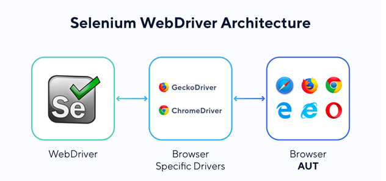
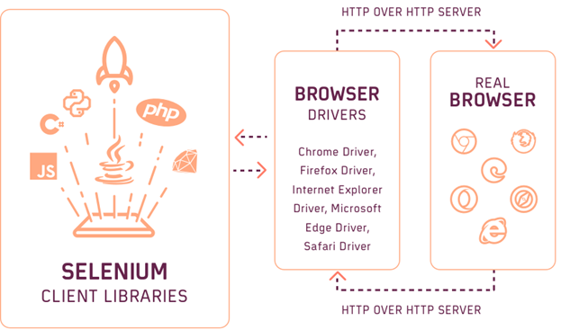

# Selenium

Selenium 是一套開源測試框架，用其他語言的測試框架不同之處在於 Selenium 是用於瀏覽器自動化測試的工具，並且可支援多種不同語言撰寫其測試腳本。


> from [All You Need to Know About Selenium WebDriver Architecture](https://kiwiqa.co.uk/blog/all-you-need-to-know-about-selenium-webdriver-architecture/)

Selenium 的運作核心如上圖所示，利用 WebDriver 的驅動服務來操控瀏覽器頁面中的 DOM 元素，需注意是針對不同瀏覽器必需使用不同的驅動；而其運用架構基礎如下圖所示，不同的語言運用對應的 Selenium 函式庫傳送 HTTP 內容給 WebDriver 處理，在由 WebDriver 控制瀏覽器的運作。


> from [All You Need to Know About Selenium WebDriver Architecture](https://kiwiqa.co.uk/blog/all-you-need-to-know-about-selenium-webdriver-architecture/)

基於其架構概念，Selenium 共有三個核心服務：

+ [Selenium WebDriver](https://www.selenium.dev/documentation/webdriver/)
其架構核心，用於遠端控制 ( Remote Cotnrol ) 瀏覽器，並讓不同語言可基於其提供的物件導向 API 撰寫其測試內容。

+ [Selenium IDE](https://www.selenium.dev/selenium-ide/)
基於瀏覽器的操作介面，可用於記錄操作方式並重複運用測試內容。

+ [Selenium Grid](https://www.selenium.dev/documentation/grid/)
基於大型服務網站其需求，設計以達到遠端控制、平行處理、跨瀏覽器的測試內容；在原理上類似多個 WebDriver 對不同瀏覽器進行多緒的平行測試。

## 基礎建置

本專案基於兩種開發方式考量，規劃並建置其使用方式：

+ 開發人員環境，利用開發人員本機的瀏覽器來監看測試腳本的執行結果
+ 自動化環境，在 CI/CD 環節中使用全容器服務且無 UI 狀況的自動化測試，但仍需保留異常或測試結果資訊

### 本地開發環境

+ 下載並安裝 Python
    - 使用 [Python for Windows](https://www.python.org/downloads/windows/)
    - 使用 [Microsoft Store : Python](https://apps.microsoft.com/search/publisher?name=Python+Software+Foundation&hl=en-us&gl=US)
+ 建立 [Python 虛擬環境](https://docs.python.org/zh-tw/3/tutorial/venv.html)
+ 安裝 [Selenium 函式庫](https://www.selenium.dev/documentation/webdriver/getting_started/install_library/)
+ 執行範例程式
    - 執行 ```do local dev``` 進入 Python 虛擬環境並執行 ```python .\src\local-demo.py```
    - 執行 ```do local demo``` 直接執行範例腳本 ```local-demo.py``` 檔案

### 容器開發環境

容器開發環境是利用 Selemiun Grid 機制，將整個開發與測試皆放置於容器中，以此確保從開發、整合、測試階段的環境一致性，進而達到平行測試、跨瀏覽器測試；以下為整合環境的執行命令：

+ ```do docker dev up```：使用 docker-compose 啟動開發容器
+ ```do docker dev down```：使用 docker-compose 關閉開發容器
+ ```do docker dev into -t=[container_name]```：使用 docker 指令進入容器中
    - 進入 Selenium SDK 環境使用 ```do docker dev into -t=selenium-sdk```
    - 進入 Chrome 瀏覽器環境使用 ```do docekr dev into -t=chrome-browser```
+ ```do docker dev open```：開啟 Chrome 瀏覽器並顯示容器對外開放的兩個網址
    - ```localhost:4444```，為 Selenium Grid 伺服器
    - ```localhost:7900```，為 Standalone 提供的 VNC 服務，以此顯示瀏覽器實際執行的狀況
+ ```do docker demo```：啟動開發環境並直接執行測試範例 ```docker-demo.py```

## 文獻

+ [Selenium](https://www.selenium.dev/)
    - [Selenium - Dockerhub](https://hub.docker.com/u/selenium)
    - [docker-selenium - Github](https://github.com/SeleniumHQ/docker-selenium)
    - 教學文獻
        + [How to run Selenium Tests in Docker](https://www.browserstack.com/guide/run-selenium-tests-in-docker)
        + [Selenium Automation Testing: A Step by Step Beginners Guide](https://www.simplilearn.com/tutorials/selenium-tutorial/selenium-automation-testing)
        + [Steps to run Selenium Tests in Docker](https://medium.com/@sharmila.may5/steps-to-run-selenium-tests-in-docker-7610281a5581)
+ [How can I run Selenium tests in a docker container with a visible browser?](https://stackoverflow.com/questions/62011537)
    - [Run GUI Applications in a Docker Container](https://gursimarsm.medium.com/ca625bad4638)
    - [Running a GUI application in a Docker container](https://linuxmeerkat.wordpress.com/2014/10/17/running-a-gui-application-in-a-docker-container/)
    - [Disposable Selenium Grid Infrastructure Using Docker](https://medium.com/@jyoti.kalra3/ad21e003aa18)
        + [Zalenium - A flexible and scalable Selenium Grid.](https://opensource.zalando.com/zalenium/)
        + [Simplify Selenium Grid Management with Zalenium](https://medium.com/@ram.machavaram/730c6363c038)
